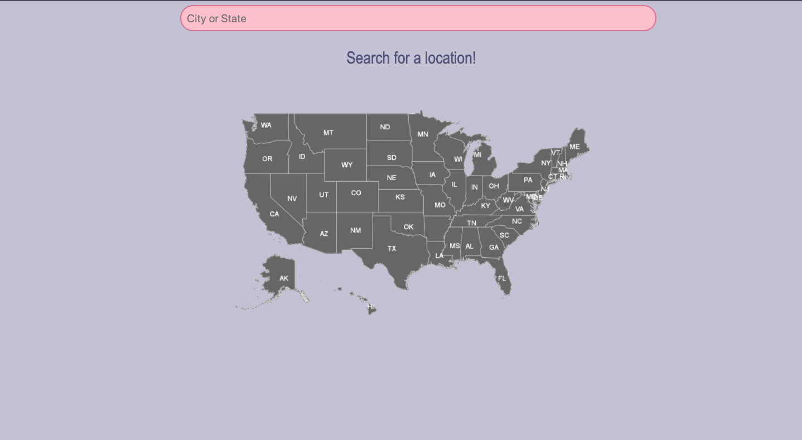
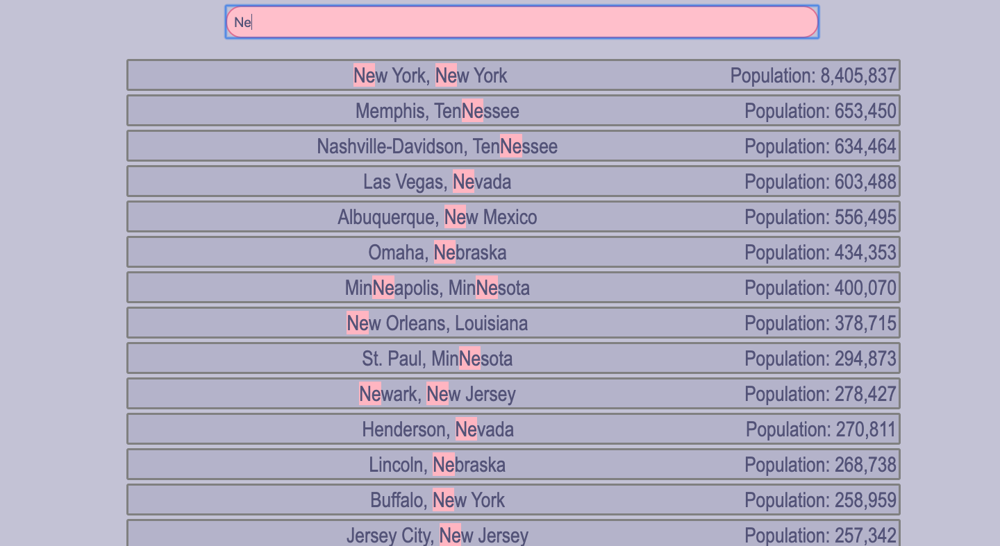

# JavaScript30

Grab the course at [https://JavaScript30.com](https://JavaScript30.com)

SUMMARY:
Created a simple live search function employing filter and regex and also practiced CSS styling. This was a good refresher on previously learned concepts!

